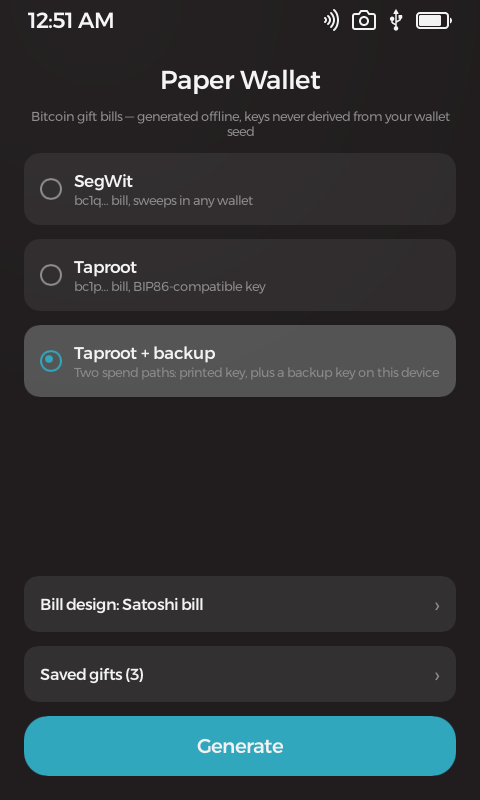
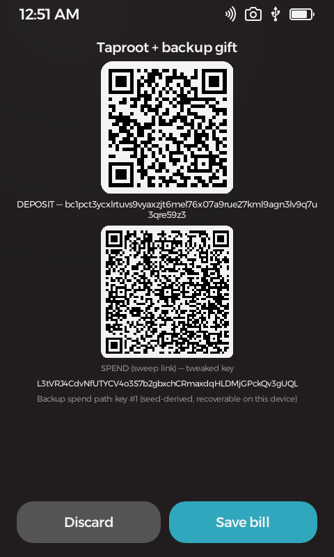
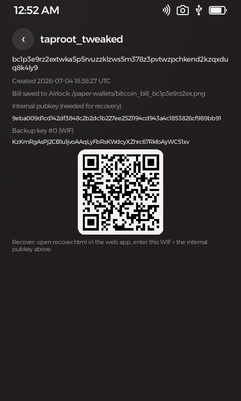
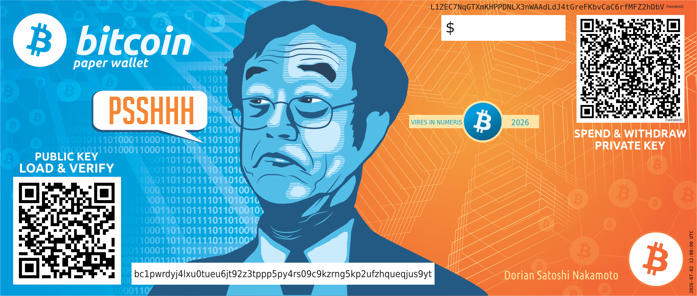
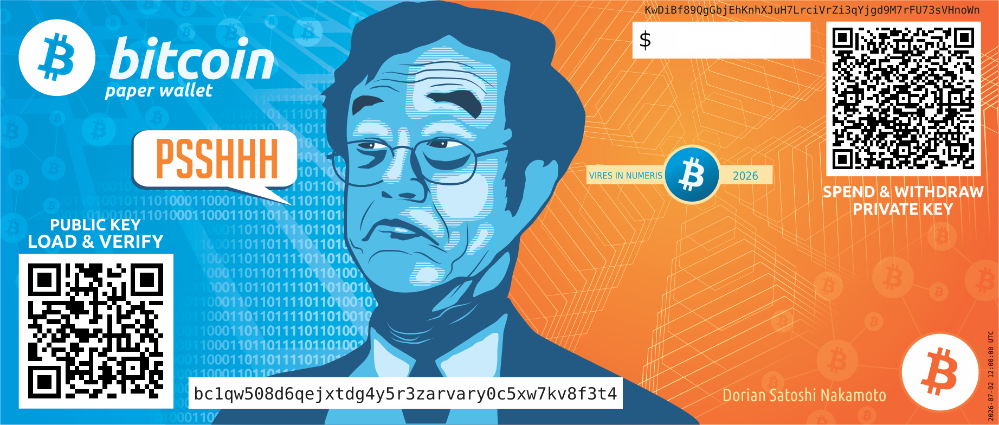

#  Paper Wallet

**Bitcoin · Gifts** — turn your Passport Prime into a printing press for bitcoin gifts.

Paper Wallet generates classic "satoshi bill" gift wallets entirely offline. Each bill carries a brand-new private key born in the device's hardware random-number generator — never derived from your wallet seed, so a gifted bill can never endanger your own funds. The app renders the key onto print-ready artwork with two QR codes, and exports a PNG plus a backup file to wherever you want to print from.

Bills are fully compatible with the [bitcoin-gift-paper-wallet](https://github.com/ObjSal/bitcoin-gift-wallet) web app: recipients sweep with the same guided flow, and givers recover unswept gifts with the same recovery page.

<p align="center">
  
  &nbsp;
  
  &nbsp;
  
</p>

## The bill

A print-ready 1843×784 PNG. The left QR is the deposit address — load and verify the gift. The right QR is a sweep link that opens the web app's guided sweep flow with everything pre-filled. The private key is printed on the top strip, the address on the bottom band, and the generation timestamp runs up the right edge.

<p align="center">
  
</p>
<p align="center">
  
</p>

> These sample bills are rendered from **publicly known test keys** — do not send funds to them. The app-screen captures likewise show throwaway simulator keys that never held funds.

## Features

- **Three gift styles** — **SegWit** (`bc1q…`, sweeps in any wallet), **Taproot** (`bc1p…`, modern and wallet-importable), and the flagship **Taproot + backup**: the recipient sweeps with the key on the bill, while *you* keep a separate backup spend path to recover an unswept gift.
- **Backup keys that survive anything** — the giver's backup keys are derived from the device master seed. A factory reset plus seed-phrase restore re-derives every backup key; the gift keys themselves stay pure hardware randomness, invisible to anyone restoring the phrase.
- **Design your own bill** — the satoshi artwork is just the default. Export the built-in design kit, restyle the template in any image editor, and the app validates and renders your custom design with the same engine as the original.
- **Save it your way** — a full save-as browser across Internal, Airlock, and USB with folder creation, custom filenames, and overwrite protection (a bill names a unique key — the app won't let two collide).
- **A gift ledger without secrets** — the saved-gifts list keeps each gift's address, type, and creation date with **no private keys stored**; the backup key is re-derived and shown only on demand, exactly when recovery needs it.
- **Offline by design** — Prime has no network stack. Sweeping, balance checks, and broadcast intentionally stay in the companion web app.

## Get it running

With the Foundation SDK installed, build and launch in the simulator with:

```bash
foundation sim
```

See **[DEVELOPMENT.md](DEVELOPMENT.md)** for environment setup, the crypto stack, the bill-template format, testing, and permissions.

## Learn more

- [DEVELOPMENT.md](DEVELOPMENT.md) — building, crypto internals, custom-template spec, testing, permissions
- [THIRD-PARTY.md](THIRD-PARTY.md) — libraries, fonts, and artwork this app is built on
- [NOTES.md](NOTES.md) — verified results and platform gotchas

## License & disclaimer

Licensed under the GNU General Public License v3.0 or later — see [COPYING](COPYING). Sections 15–17 of that license disclaim all warranty and limit liability; the notes below restate that in plain language.

This is experimental software and it has **not been independently audited**.
It is provided **"as is", without warranty of any kind**, express or implied,
including but not limited to the warranties of merchantability, fitness for a
particular purpose, and non-infringement.

**Use it at your own risk.** To the maximum extent permitted by law, in no
event shall the authors, copyright holders, or contributors be liable for any
claim, damages, or other liability — including, without limitation,
**loss of bitcoin or other funds, loss of keys or seeds, or loss of data** — whether in an action of contract, tort, or
otherwise, arising from, out of, or in connection with this software or its
use.

Nothing in this project is financial, investment, legal, or tax advice. You
are solely responsible for verifying addresses, amounts, fees, and backups
before moving funds, and for complying with the laws of your jurisdiction.
Test on test networks, or with amounts you can afford to lose, first.

A paper wallet is a **bearer instrument**: anyone who holds the bill — or a photo, scan, or copy of it — can take the funds. A lost or destroyed bill with no backup key is unrecoverable. Nobody can reverse a bitcoin transaction or restore keys for you.
