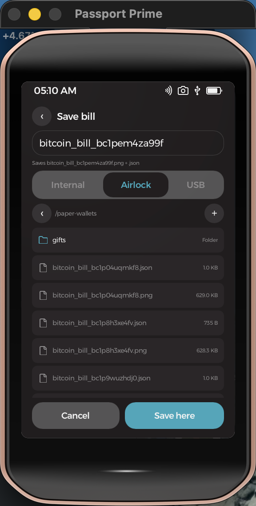
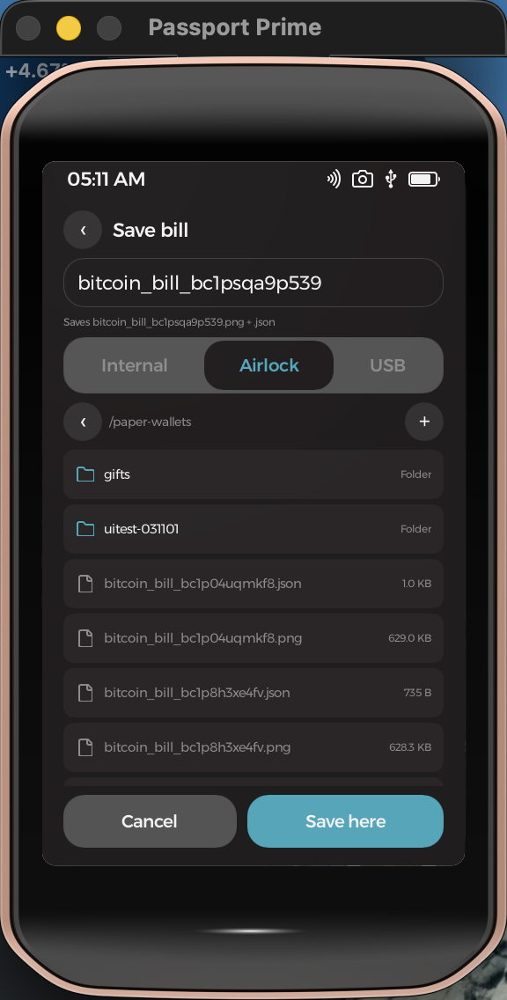
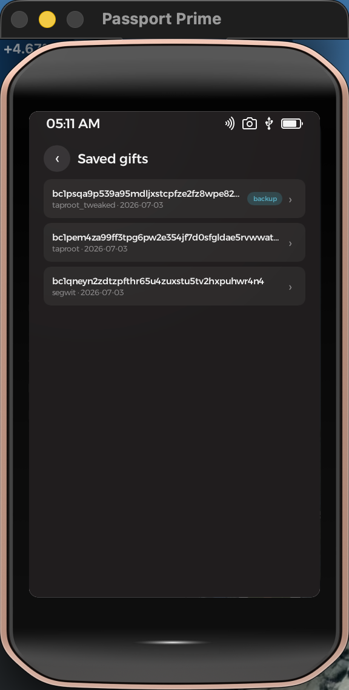

# Paper Wallet — a Passport Prime app

A bitcoin **gift paper-wallet generator** for Foundation's **Passport Prime**,
built as a Rust binary with a **Slint** UI on **KeyOS** (Foundation's Rust
microkernel on Xous). It generates a fresh private key from the hardware
TRNG — never derived from your wallet seed — renders it onto the classic
"satoshi bill" artwork with two QR codes, and exports a printable PNG plus a
backup JSON to Internal, Airlock, or USB storage. Fully offline, like
everything on Prime.

It is a device port of the
[bitcoin-gift-paper-wallet](https://github.com/ObjSal/bitcoin-gift-paper-wallet)
web app's generation flow, byte-for-byte compatible: bills printed from the
Prime scan into the same hosted **sweep** page, and giver-side recovery uses
the same **recover** page.

<p align="center">
  
  &nbsp;
  
  &nbsp;
  
</p>

## The bill

1843×784 PNG, print-ready. Left QR = deposit address (load & verify); right
QR = a sweep link that opens the web app's guided sweep flow with the WIF,
network, and address type pre-filled. The private key is printed on the top
strip, the address on the bottom band, with the generation timestamp rotated
along the right edge.

<p align="center">
  
</p>
<p align="center">
  
</p>

> These sample bills are rendered from the **publicly known test key k=1**
> (the BIP173/BIP341 example key) and the fixture backup key `0x11…11` —
> do not send funds to them. The app-screen captures likewise show throwaway
> simulator-generated keys that never held funds.

## Features

- **Three variants (mainnet)**:
  - **SegWit** (`bc1q…`) — P2WPKH; the bill's WIF sweeps in any wallet.
  - **Taproot** (`bc1p…`) — BIP341 key-path only; the bill prints the
    untweaked WIF (BIP86-compatible: imports into Sparrow, BlueWallet, …).
  - **Taproot + backup** — the flagship two-key gift: the output commits to
    a `<backup_pubkey> OP_CHECKSIG` tapscript leaf. The **recipient** sweeps
    with the tweaked WIF printed on the bill (labeled *(tweaked)*); the
    **giver** keeps a backup spend path and can recover an unswept gift via
    the web app's recover page (script-path spend).
- **Seed-recoverable backup keys**: the giver's backup key is derived from
  the device master seed via the KeyOS `GetAppSeed` service (HKDF, indexed) —
  a factory reset + seed-phrase restore re-derives every backup key. The
  gift key itself is deliberately **pure TRNG**: a compromised bill can
  never endanger your seed, and gifts aren't visible to anyone restoring
  the phrase.
- **Save-as browser**: pick Internal / Airlock / USB, navigate directories,
  create folders, and name the file. Writes `<name>.png` + `<name>.json`
  together and refuses to overwrite an existing bill (a bill names a unique
  key). The JSON uses the web app's backup schema — the recover page imports
  it directly.
- **Saved gifts list**: per-gift metadata (address, type, creation date,
  internal pubkey, backup index, export path) is kept on Internal storage
  with **no private keys**. The detail screen re-derives and shows the
  backup WIF (text + QR) on demand, alongside the internal pubkey — exactly
  the recovery tuple recover.html asks for.

<p align="center">
  
  &nbsp;
  
  &nbsp;
  
</p>

Sweeping, balance checks, and broadcast intentionally stay in the companion
web app — Prime has no network stack by design.

## Crypto stack

Pure Rust, no C dependencies: [`k256`](https://crates.io/crates/k256) for all
secp256k1 math including the BIP341 taproot tweak, `sha2`/`ripemd`/`hkdf`,
`bech32` (BIP173/BIP350), `bs58` (WIF), `qrcode`, `ab_glyph` + embedded
DejaVu fonts, and `image` for the PNG composition. Entropy comes from the
platform: on hardware builds a vendored KeyOS `getrandom` override sources
the os TRNG server; on the simulator it's the OS CSPRNG.

Correctness is pinned by **twin fixtures**: every address, WIF, tweaked key,
and script-tree hash in the test suite was generated by the web app's
reference implementation (JS, cross-validated Python twin) — the Rust port
must be byte-identical. Rendered bills are verified by decoding both QR
codes back (`rqrr`) and asserting the exact payload strings.

## Build & run

Requires the `foundation` CLI (on `PATH` at `~/.foundation/sdk/bin`) and Nix.
In a non-login shell, source Nix first:

```bash
. '/nix/var/nix/profiles/default/etc/profile.d/nix-daemon.sh'
export PATH="$HOME/.foundation/sdk/bin:$PATH"
```

Then, from this directory (via the SDK's Nix dev shell):

```bash
nix develop ~/.foundation/sdk/current --command foundation sim     # hosted simulator
nix develop ~/.foundation/sdk/current --command foundation build   # compile + sign a hardware bundle
nix develop ~/.foundation/sdk/current --command cargo test -p wallet-core   # host test suite
```

Render sample bills on the host (fixed test keys):

```bash
nix develop ~/.foundation/sdk/current --command \
  cargo run -p wallet-core --example render_samples -- /tmp
```

> **Hardware sideload** (`foundation sideload`) is **not** possible on a retail
> Prime — it needs dev firmware from Foundation. The simulator is the
> verification target. See `NOTES.md`.

## Testing

All wallet logic lives in the UI-free **`wallet-core/`** subcrate so it can
be tested on the host: 15 tests covering the twin fixtures across all three
variants, published BIP173/BIP350/BIP340/RIPEMD vectors, WIF round-trips,
backup-key derivation determinism, TRNG rejection-sampling, and full bill
composition with QR round-trip decoding. A workspace-level simulator UI test
(`../ui-automation/tests/paper-wallet.sh`) drives every flow through real
taps — generate + save each variant through the save browser, folder
creation via the on-screen keyboard, the saved-gifts list, and the
backup-key reveal.

## Permissions

Declared in `app-config.toml` → `[permissions]`:
`template = ["gui-app", "fs-generic", "fs-access"]` (UI + read/write
filesystem across `User`/`Airlock`/`USB`), `"os/fs" = ["MountAirlock",
"FormatAirlock"]` (the app mounts Airlock lazily for exports; nothing else
mounts it in the hosted simulator), and `"os/security" = ["GetAppSeed"]` for
the deterministic backup keys. Enforced at compile time (undeclared calls
fail to build) and by the KeyOS kernel at runtime.

## Project layout

- `wallet-core/` — UI-free library: key generation, taproot tweak math,
  addresses/WIF, backup derivation, QR payloads, bill PNG composition;
  test suite + bill template & font assets.
- `src/main.rs` — app logic: screens, save browser, metadata persistence,
  Airlock lifecycle, callbacks.
- `ui/app.slint`, `ui/callbacks.slint` — the UI and the Slint↔Rust bridge.
- `vendor/getrandom/` — KeyOS's getrandom override (TRNG on hardware).
- `vendor/security-api/` — KeyOS `os/security` API crate (GetAppSeed),
  adapted to the installed SDK's server conventions.
- `app-config.toml` / `permission_templates.toml` — hand-edited config
  (`manifest.toml` is generated; don't hand-edit).

See **`CLAUDE.md`** for architecture detail and **`NOTES.md`** for verified
results and the non-obvious gotchas (Airlock mount/format/unmount lifecycle,
the hidden metadata store, k256 API notes, Slint layout pitfalls).

## Notes

Scaffolded from `foundation new prime-paper-wallet --template default-app`,
then customized. Normally checked out as a git submodule of a `prime/`
workspace (alongside a local KeyOS docs knowledge base); it also builds
standalone. Verified: signed hardware build (5.9 MB), full simulator UI test
run, and byte-identical output against the web app's reference crypto — see
`NOTES.md`. Bill artwork credit: reddit u/CoinCult (via the web app).
